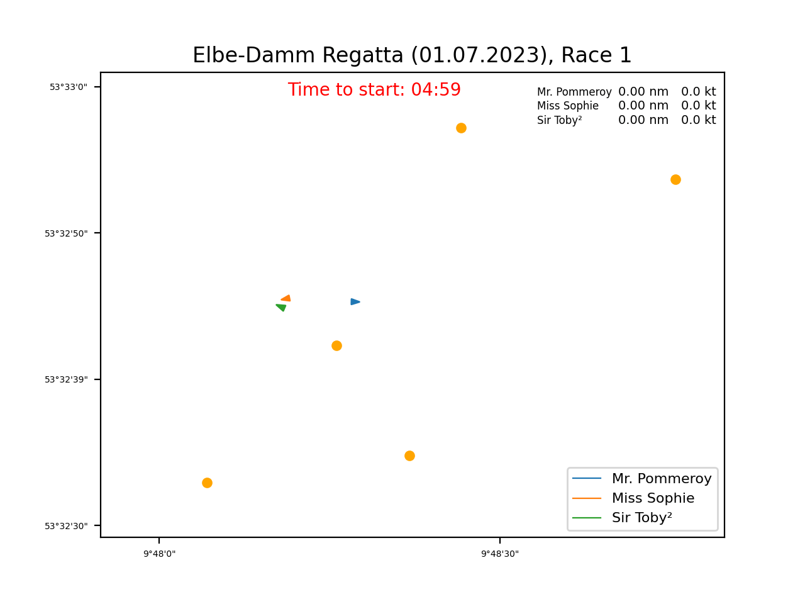
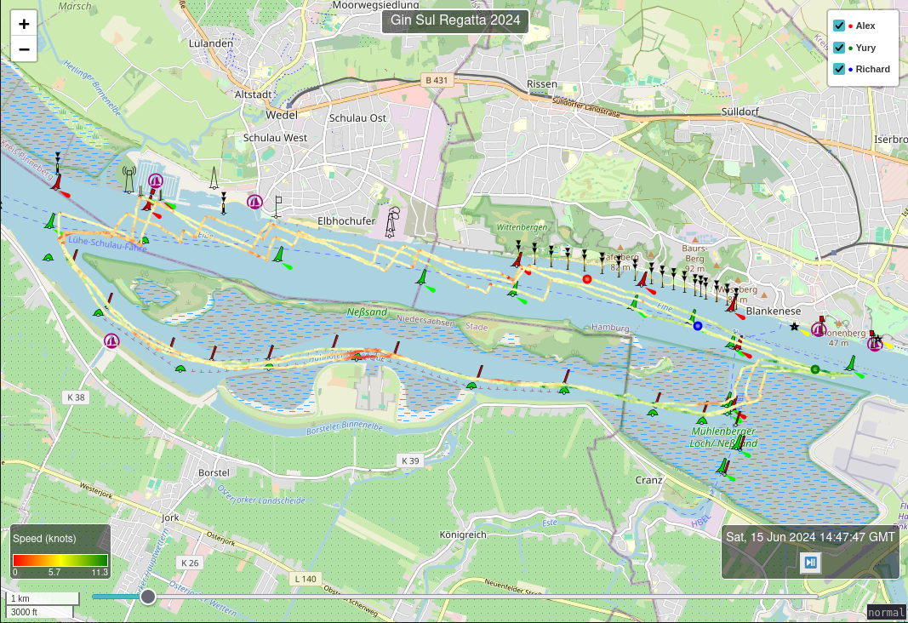

# gpx-player
## GPX Race Visualizer

GPX Race Visualizer is a Python script to visualize the progression of multiple GPS tracks (e.g., from a race) on a 2D map. 
It takes as input one or more GPX files and creates an animation showing the movement of each track over time. 
This is a simple, open-source alternative to features like Strava's Flyby, which require an account and can have privacy issues.

### Modes
The player supports two modes:
#### 1. "Video" mode
Produce an `MP4` or a `GIF` file showing how the situation developed.
For sailing races, it also calculates the distance covered after the 'start' signal and the current speed.
##### Example:


#### 2. Map mode
Displays the track on OpenSeaMap.
You can see the full tracks with colour-coded speeds, 
and you can 'play' the tracks and see the markers move around the map.

#### Example:
Since GitHub Markdown doesn't allow embedding HTML, 
you can see an [interactive example](https://kirienko.github.io/static/GinSul-2024.html) here.

Screenshot:
[](https://kirienko.github.io/static/GinSul-2024.html)
## Installation

Clone the repository and install the required dependencies with pip:

```bash
git clone https://github.com/kirienko/gpx-player.git
cd gpx-player
pip install -r requirements.txt
```

## Usage
To run the script producing `mp4`, pass one or more GPX file paths as command-line arguments:
```bash
python main.py example-data/track1.gpx example-data/track2.gpx
```
To get a sea map, run the `openseamap.py`:
```bash
python openseamap.py --title 'Gin Sul Regatta 2024' --names Alex Yury Richard \
     --files example-data/osm-demo-Alex.gpx example-data/osm-demo-Richard.gpx \
             example-data/osm-demo-Yury.gpx
```

A more sophisticated example, that produced a video above:
```bash
python main.py example-data/track1.gpx example-data/track2.gpx example-data/track3.gpx \
       --start 2023-07-01T10:53:00+0200 \
       --names "Mr. Pommeroy" "Miss Sophie" "Sir Toby²" \
       --title "Elbe-Damm Regatta (01.07.2023), Race 1" \
       --race_start 2023-07-01T10:58:00+0200 --marks example-data/marks.txt -g
```
### Additional parameters:
* `--title` or `-t`: The title of the video
* `--start` or `-s`: start time in the format `2023-06-30T10:53:00+0200`, all points before that will not be plotted
* `--names` or `-n`: names of the participants (otherwise the file names will be used in the legend)
* `--race_start`, `-r`: Race start time in the format `YYYY-MM-DDTHH:MM:SS%z`, e.g. `2023-07-01T12:29:00+0200`
* `--names` or `-n`: Names of the participants
* `--marks`or`-m`: The file with the static marks to put onto the map. One pair of coordinates per line, see below.
* `--gif` or `-g`: Save as GIF moving picture instead of MP4

## Marks
The script also supports visualizing predefined marks on the map, which can be useful for events like sailing regattas.
The marks are defined as a list of (latitude, longitude) tuples in a separate text file and can be added to the script as follows:
```
53.542484632728, 9.801163896918299
53.542997846049374, 9.80611324310303
53.54823800356785, 9.812614917755129
53.54921647691311, 9.807373881340029
53.54508251196638, 9.80433225631714
```

## Getting GPX Files

GPX files can be obtained from several GPS-tracking services:
* Strava: Go to the activity page and click on the wrench icon. Then select "Export GPX".
* Garmin Connect: Open the activity, go to the gear icon and select "Export to GPX".
* Endomondo: From the workout page, click the three-dot menu icon and select "Export". Then choose "GPX".

## Support
Now you can buy me a coffee to encourage further development!

[](https://www.buymeacoffee.com/kirienko)
